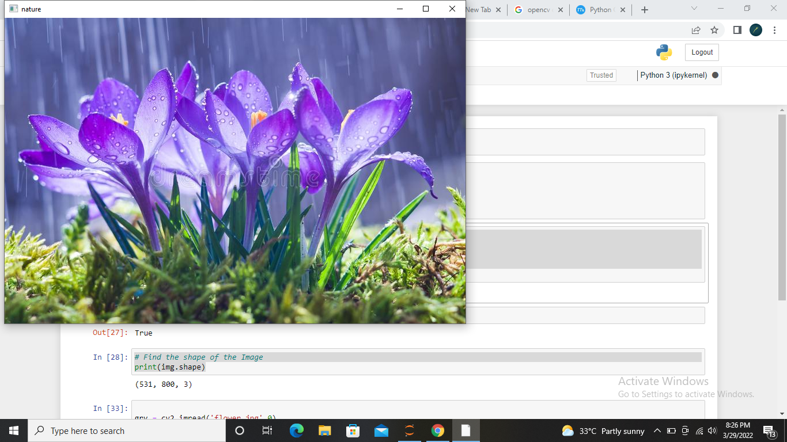
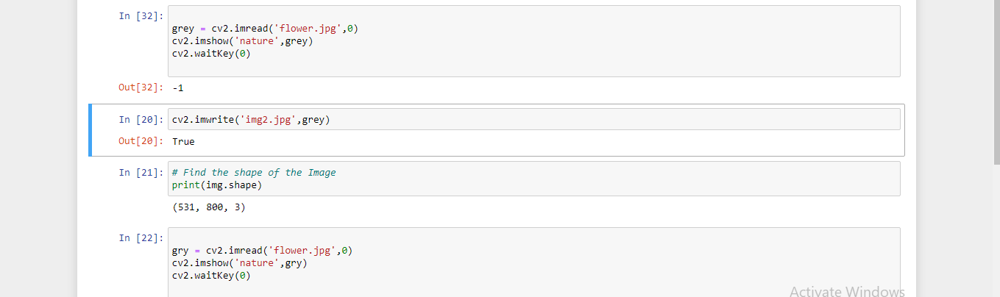
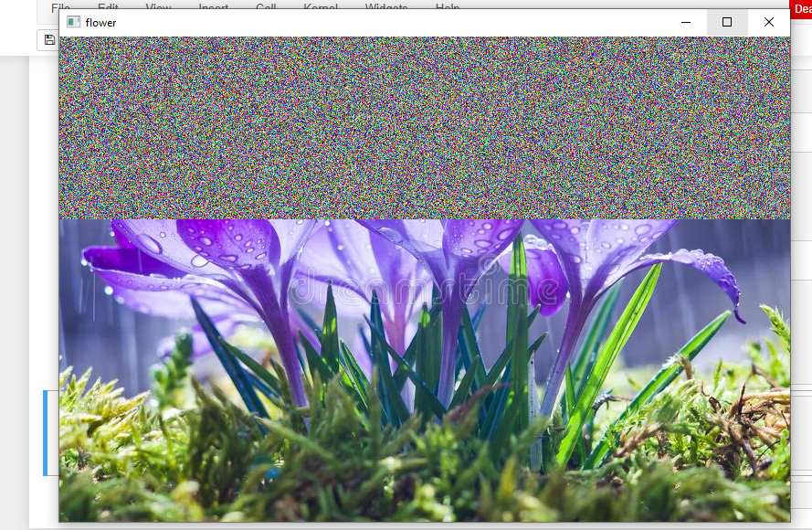
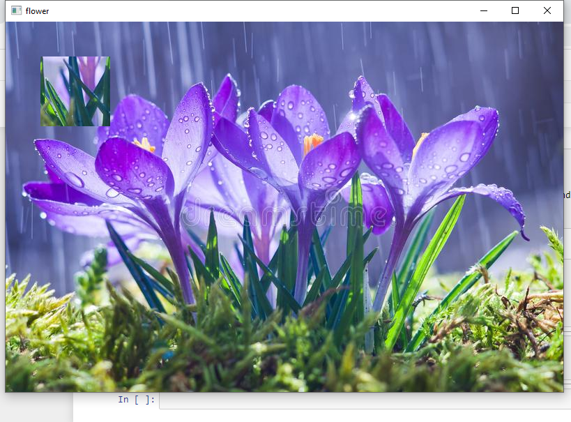

# READ AND WRITE AN IMAGE
## AIM
To write a python program using OpenCV to do the following image manipulations.
i) Read, display, and write an image.
ii) Access the rows and columns in an image.
iii) Cut and paste a small portion of the image.

## Software Required:
Anaconda - Python 3.7
## Algorithm:
### Step1:
Choose an image and save it as a filename.jpg
### Step2:
Use imread(filename, flags) to read the file.
### Step3:
Use imshow(window_name, image) to display the image.
### Step4:
Use imwrite(filename, image) to write the image.
### Step5:
End the program and close the output image windows.
## Program:
```python
# Developed By:KUMARAVEL V
# Register Number:212220230027

#import the library
import cv2

# To Read,display the image
img = cv2.imread('flower.jpg',1)
cv2.imshow('nature',img)
cv2.waitKey(0)

#GREY IMAGE
grey = cv2.imread('flower.jpg',0)
cv2.imshow('nature',gray)
cv2.waitKey(0)

# To write the image

cv2.imwrite('ou2.jpg',grey)


# Find the shape of the Image
print(img.shape)


# To access rows and columns

import random
for i in range(200):
    for j in range(img.shape[1]):
        img[i][j] = [random.randint(0,255),random.randint(0,255),random.randint(0,255)]
cv2.imshow('flower',img)
cv2.waitKey(0)


# To cut and paste portion of image

img1 = cv2.imread('flower.jpg',1)
tag = img1[300:400:,300:400]
img1[50:150,50:150] = tag
cv2.imshow('flower',img1)
cv2.waitKey(0)


```
## Output:

### i) Read and display the image



### gray image


### ii)Write the image

<br>
<br>

### iii)Shape of the Image

<br>

<br>

### iv)Access rows and columns
<br>

<br>

### v)Cut and paste portion of image
<br>

<br>

## Result:
Thus the images are read, displayed, and written successfully using the python program.


